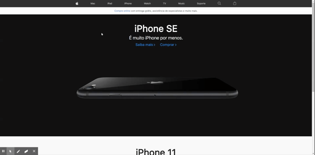

# <h1 align='center'>UI Clone - Apple 🍎</h1> 

  

  

  

  

_________

## 🎨 Layout

    

_________

## 💻 Sobre o projeto

🍎 UI Clone Apple.

Clone de Interface do site da Apple.

Projeto desenvolvido para melhorar o conhecimento em HTML + CSS.

_________

## 🛠 Tecnologias

As seguintes ferramentas foram usadas na construção do projeto:
 
 - [HTML5]
 - [CSS3] 

- Programado no [Visual Studio Code].

_________

## 🚀 Como executar o projeto

    # Clone esse repositório.
    $ git clone https://github.com/philipeperete/UICloneApple
    
    # E para executar:
    $ Abra o index.html

_________

## 💡 Pré-requisitos

Antes de começar, você vai precisar ter instalado em sua máquina as seguintes ferramentas:
[Git](https://git-scm.com).
Além disto é bom ter um editor para trabalhar com o código como [Visual Studio Code].

_________ 

## 📝 Licença

O projeto se encontra sob licença MIT.

Para mais detalhes, acesse [license](LICENSE).

_________

* Twitter: [Philipe Perete](https://twitter.com/PhilipePerete).
* Linkedin: [Philipe Perete](https://www.linkedin.com/in/philipe-perete-b76622104/).
* Github: [Philipe Perete](https://github.com/philipeperete).

Feito com 💙 por **Philipe Perete** 👻.

[HTML5]: https://developer.mozilla.org/en-US/docs/Web/Guide/HTML/HTML5
[CSS3]: https://developer.mozilla.org/en-US/docs/Archive/CSS3

[Visual Studio Code]: https://code.visualstudio.com/ 